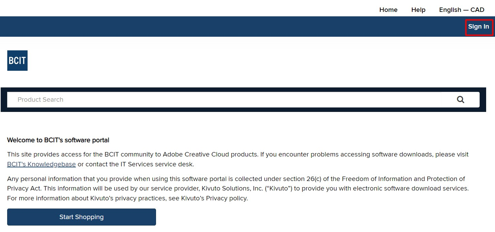
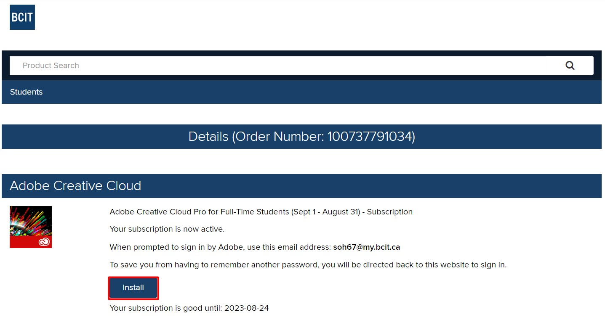

# Installing Photoshop via BCIT

1. Log into bcit software portal.
    * Visit the website by [clicking this link](https://bcit.onthehub.com/WebStore/Welcome.aspx)
        * or search google for "bcit software portal hub" and select the first result.
    * click the **Sign In** on the top-right corner of the site
    
    * Log in with your BCIT credentials (BCIT email and password). You will be returned to the previous page while signed in.
    * Search for the term 'adobe'. There should be only 1 result (_Adobe Creative Cloud Pro_). Click **Add to Cart** to the right of the page.
    

2. activate adobe license in bcit software portal
    * !need screenshots!!
    

3. Download Adobe Creative Cloud
    * Click install. You will be lead to the download creative cloud webpage.
    
    * Click **Download Creative Cloud**
    
    * Launch the downloaded Creative_Cloud_Set-Up.exe
    * !need screenshots!!

4. Log into Creative Cloud
    * Launch the Creative Cloud Desktop app and enter your bcit student email to log in.

5. Download Photoshop in the Creative Cloud.
    * Verify that you are one 

6. open photoshop

7. Open image
    * open image (drag and drop)
    * _Or_ File -> Open
        1. Browse to file location
        2. Select image to open
