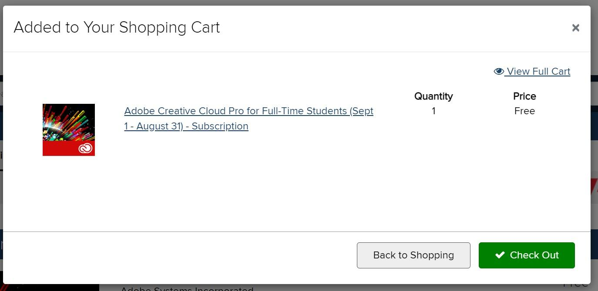
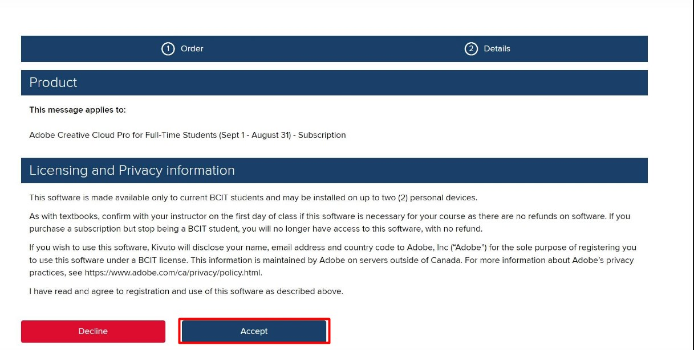

# Installing Photoshop via BCIT

## Log into BCIT Software Portal

1. Visit the [BCIT Software Portal.](https://bcit.onthehub.com/WebStore/Welcome.aspx)
    - Alternatively, search Google for "bcit software portal hub" and select the first result.
2. Click **Sign In** on the top-right corner of the site.
    
3. Log in with your BCIT credentials (BCIT email and password).
    You will be returned to the previous page once signed in.
4. Search for the term 'adobe'. There should be only 1 result, "_Adobe Creative Cloud Pro_". Click **Add to Cart** to the right of the page.
    

## Activate Adobe License in BCIT Software Portal

1. Click the checkout button to confirm your purchase.

2. Accept the licensing agreement and proceed with on-screen instructions.

## Download Adobe Creative Cloud

1. Click **Install**. You will be led to the "Download Creative Cloud" webpage. 
2. Click **Download Creative Cloud**
    
3. Launch the downloaded **Creative_Cloud_Set-Up.exe**.
4. Whenever prompted to sign in for authentication, **log in using your BCIT email**.
    

## Download Photoshop in the Creative Cloud portal.

- Once logged in, you should be on the _All Apps_ page for desktop by default

1. Click the **Install** button for Photoshop.
    

2. Click the **Open** photoshop button on the updated Creative Cloud window after installation.
    

## Open image file in Photoshop

- **Method 1**:
    - Open your image file by dragging and dropping it onto the indicated area on the landing page.
        
- **Method 2**: by menu navigation:
    1. Click **File** -> **Open**.
    2. Click the **On your computer** button on the lower left of the popup window.
        
    3. Select your desired image file in the file explorer and click open.
        
        - Congradulations! You've successfully installed Photoshop. 