This section will focus on using Photoshop to crop and compress an image.

Cropping images is essential for presentations, as slides demand only the most important information be shown. Additionally, the nature of web-based information demands images be effectively compressed to meet file size standards.

### Open your Image

1. Ensure Photoshop is installed and opened. See the section on [Installing Photoshop](../1-install-photoshop-using-bcit-account/) for more information.

    When you first open Photoshop, the main menu will appear. Any recently opened projects will appear in the center of the screen, but for now we'll be focusing on opening a new project using a pre-made image.

    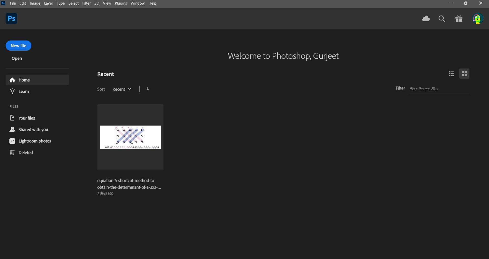

2. At the main menu, open your desired image.
    - **Method 1**:
        - Drag and drop your image onto Photoshop's interface.
    - **Method 2**: 
        - Expand the `File` tab in the navigation bar.
        - Click `Open` to open an image.
            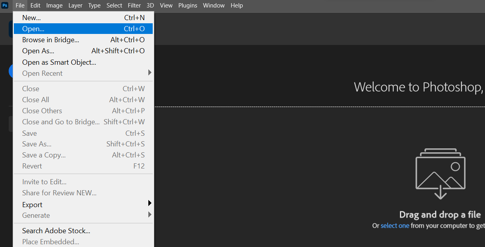
        - Navigate to your image using the opened File Explorer window.
        - Open your image.

    Your file should now be opened as a new project.

    

### Crop your Image

When an Photoshop project is opened, the most relevant editing tools are displayed on the left sidebar.
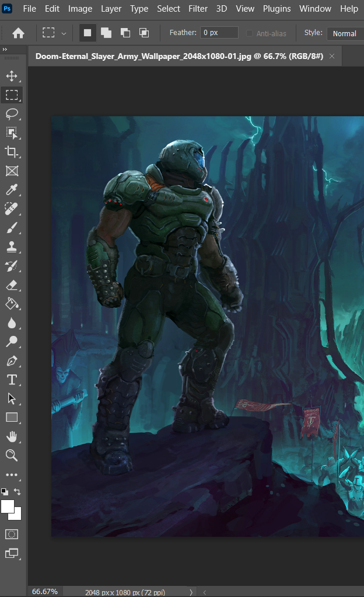

3. Navigate to the sidebar and activate the Crop tool.
    > All tools have keyboard shortcuts for easy access. The default shortcut for the Crop tool is `C`.

    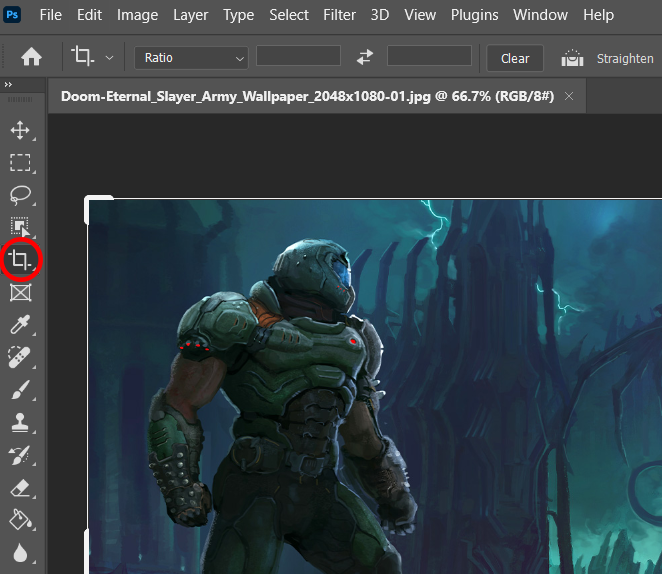

    When the Crop tool is active, the edges of the image will now be outlined, with bold handles at each edge and corner.

    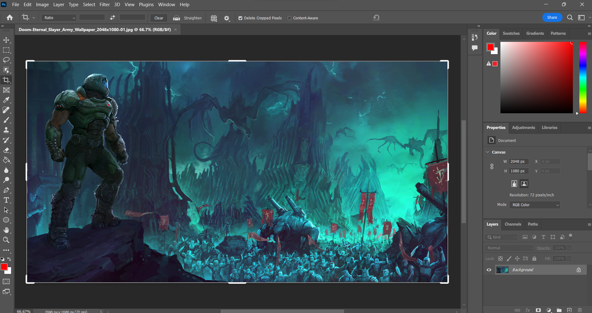

4. Drag the handles to crop the image to your desired size.

    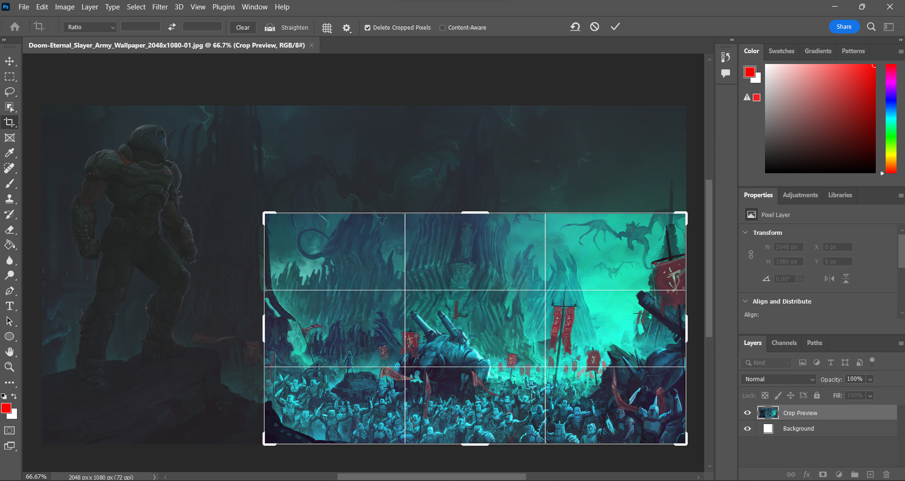

    The button to apply your changes is on the top of the screen, to the right of the navigation bar.

    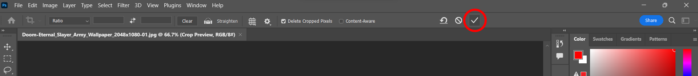

5. Click the checkmark at the top of the screen to apply your changes.
    > The default shortcut to apply your changes is `Enter`.

    The displayed image should now be cropped to your desired size.

    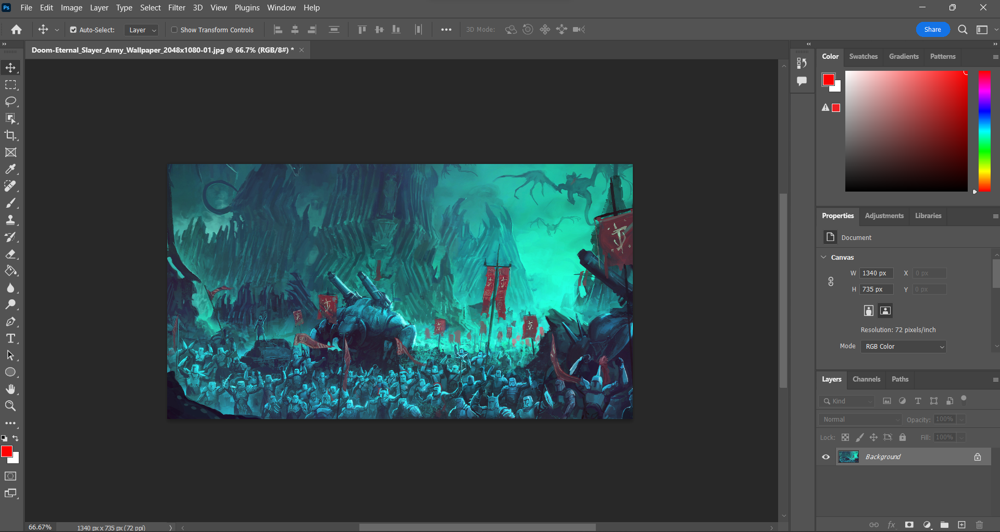

    > While the image may appear to be finalized, changes are only truly made upon **Export**ing your project to a new image.

Once your image has been cropped and any additional changes have been made, it's time to compress your image.

### Compress and Export your Image

1. Expand the `File` tab in the navigation bar.

    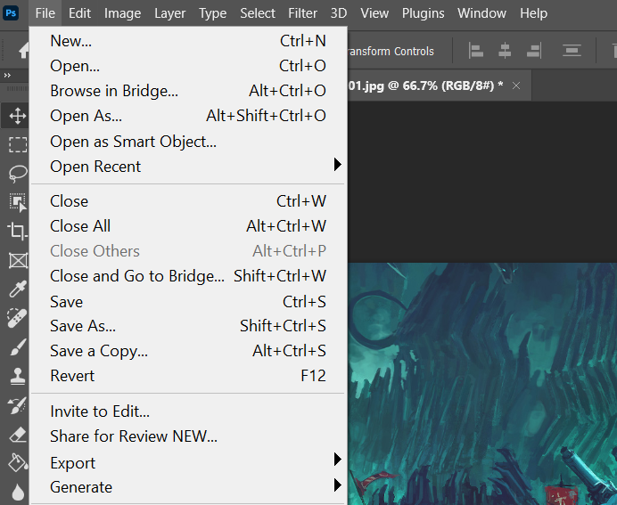

2. Hover your mouse over the `Export` submenu to open it.

    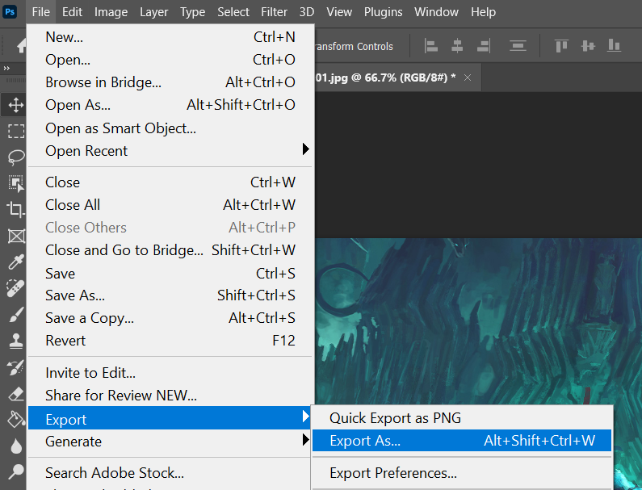

3. Select `Export As...` to open the Export menu.

    The Export menu should now be open, showing your edited image.

    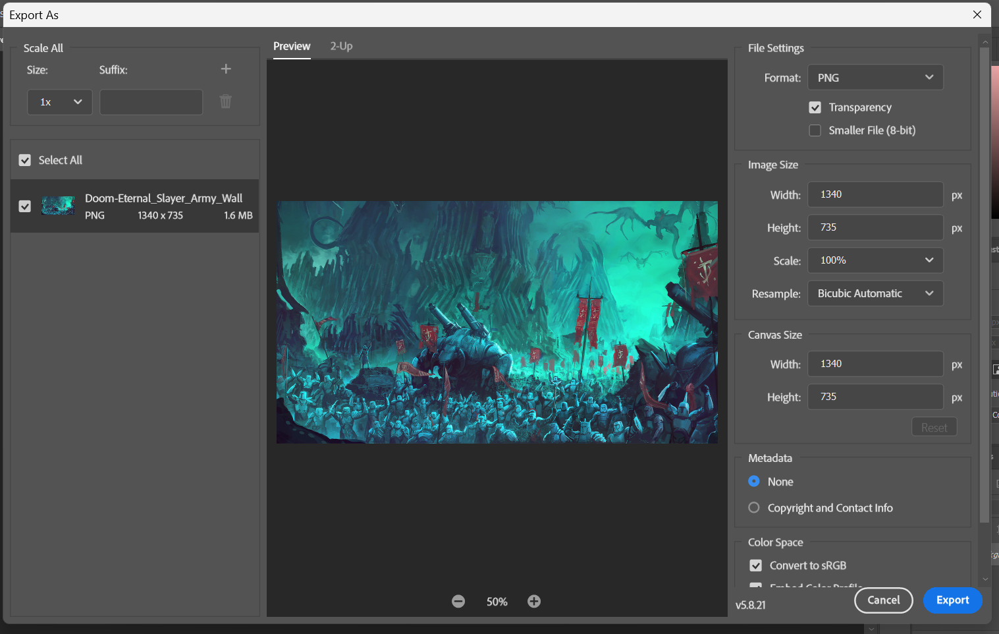

4. In the `File Settings` category, change `Format` to `JPG`.
    > After changing the format to JPG, a slider will appear labelled `Quality`. Dragging this slider will change the quality of your image; lower quality means a lower file size.

    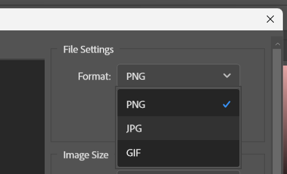

5. Click the button labelled `Export` at the bottom-right.

    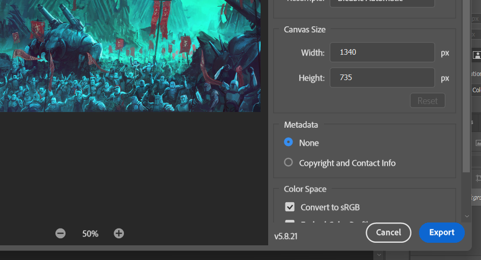

6. Navigate to where you want the compressed image to be stored using the opened File Explorer window.

7. Rename your file if desired and click `Save`.

    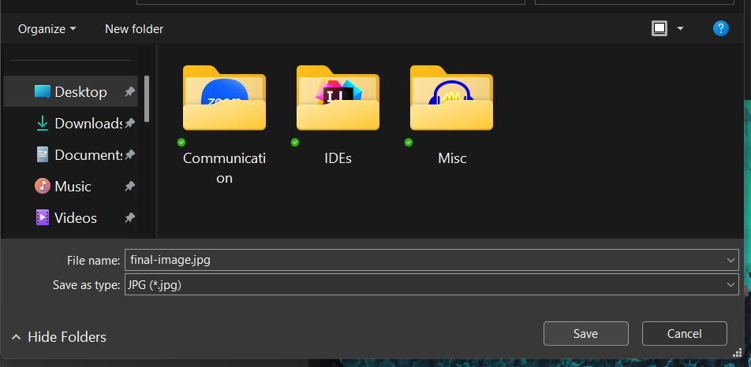

You now have a cropped and compressed file, ready to be uploaded to your website or presentation!

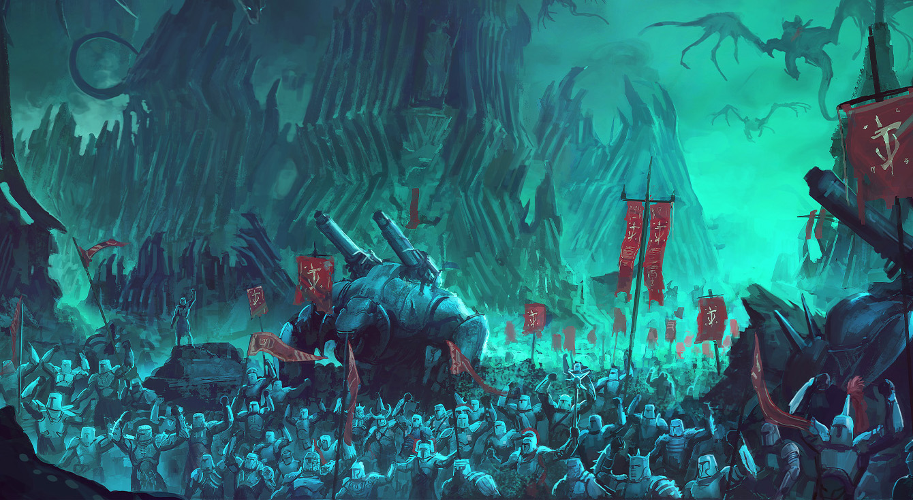