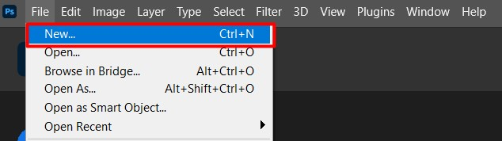
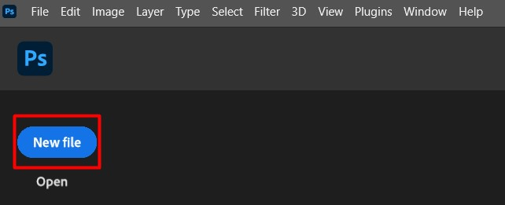
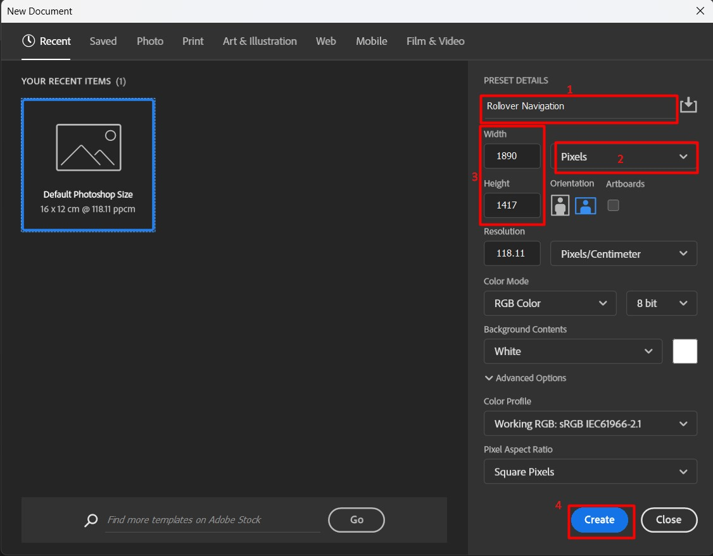
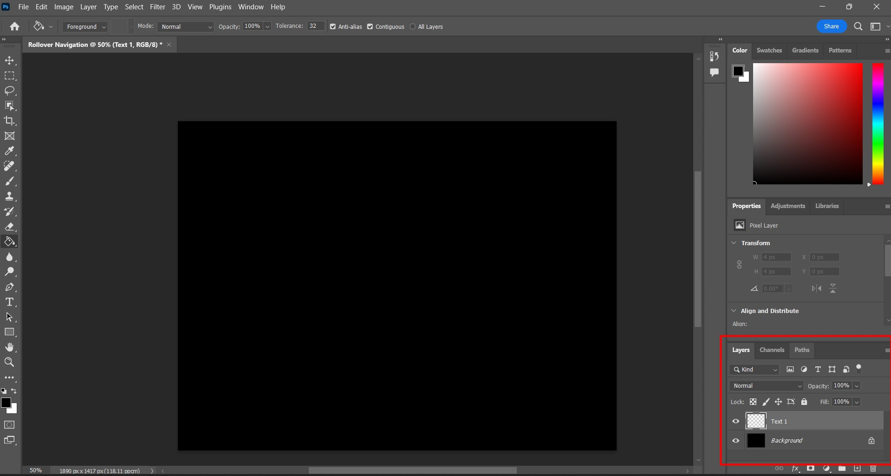
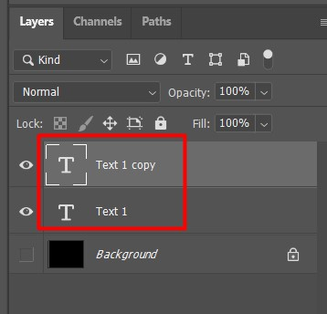

# Create rollover buttons for a website

This section will showcase how to create rollover buttons which require 2 images of texts with exactly identical placement/size while changing in color.

Rollover buttons where mouse over causes the button image to change (i.e. change to a darker shade) provide clear visual feed back to the website's user about their potential selection.

## Create new empty file

- **Method1**
    Select file from the top-left navigation bar and click new.
    
- **Method2**
    Click the blue _New file_ button to the left, below the navigation bar.
    
Completing either of the steps will bring up a _New Document_ window.

## Choose desired image size

Following is a image of the New Documents window that is labeled with necessary steps.

1. Enter the desired name of the file in the _Present Details_ field.

2. Select the units of the file that you will be working with.

3. Enter the dimensions for width and height in said dimensions.

4. Click the blue _Create_ button on the bottom right.

Once completed, your workspace will show a white rectangle with the specified dimensions/units.

## Equip paint bucket tool, change color

1. Click and hold the Gradient tool icon on the left tool bar.

2. Select Paint Bucket tool.

Once complete, the mouse cursor will change to a paint bucket icon when hovering over the workspace.

## Paint background layer

1. Select your desired background color from the color pallette to the top-right of the workspace.

2. Click on the white rectangle on your workspace. The rectangle will change to the specified color.

## Create text layer, change color (default)

1. Create a new Layer: select _Layer_ on the top navigation bar -> New -> Layer 
    - Or use shortcut shift+ctrl+N

2. Enter an easily distinguishable name (i.e. Text 1) and click OK.

    - Once complete, there should be a new Layer visible on the _Layers_ tab to the bottom right of your workspace.

3. Hide the Background layer by clicking the eye shaped icon next to the Background layer.
    - The workspace should now be a checkered rectangle.

4. Click the _Horizontal Type Tool_ on the left toolbar then click on the workspace to type in the text for your button.

    - Select the font, size, color of your text from the top to ensure it will be visible against the background color.

## Duplicate text layer using Ctrl+J (hovered)

1. Make sure the text layer is selected and press ctrl+J to copy it. Once complete, another layer with the identical name appended by _copy_ will appear in the layers tab.

## Edit hovered text layer
## Export as png
## Hide hovered layer
## Export as different png
